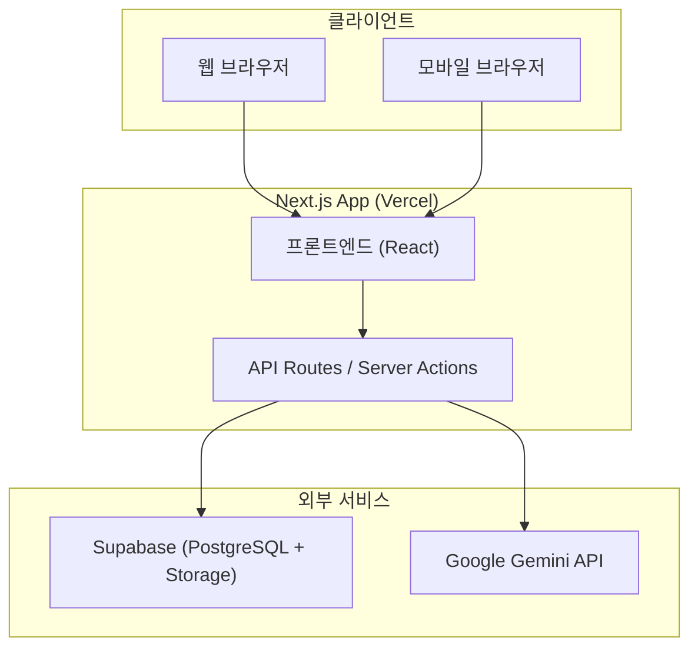
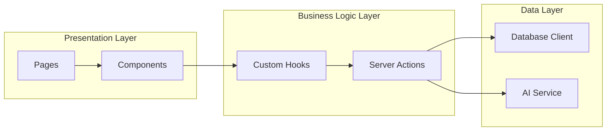
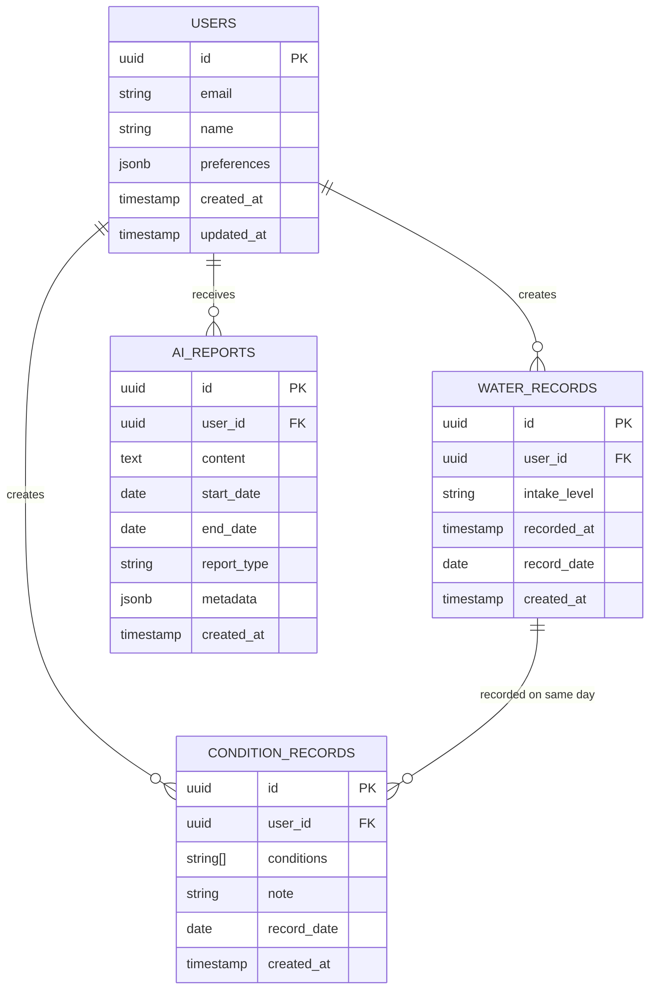
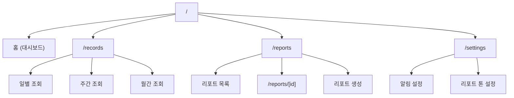
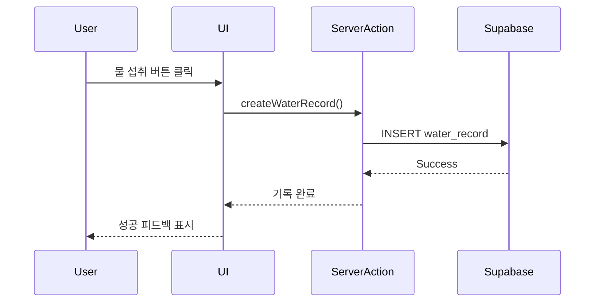
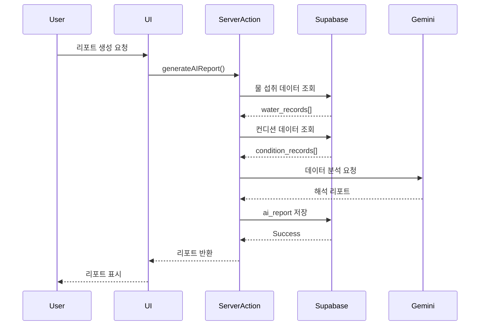

# 🏗️ 소프트웨어 디자인 및 아키텍처

> **물 섭취를 '의미 있는 변화'로 해석하는 습관형 앱**

---

## 1. 기술 스택

### 1.1 프론트엔드
- **Framework**: Next.js 14+ (App Router)
- **언어**: TypeScript
- **스타일링**: Tailwind CSS + shadcn/ui
- **상태 관리**: React Context API + React Query
- **차트**: Recharts
- **날짜 처리**: date-fns
- **폼 관리**: React Hook Form + Zod

### 1.2 백엔드
- **Runtime**: Next.js API Routes (Server Actions)
- **인증**: Supabase Auth (제외 - MVP에서는 인증 없음)
- **데이터베이스**: Supabase (PostgreSQL)
- **스토리지**: Supabase Storage
- **AI**: Google Gemini API

### 1.3 배포 및 인프라
- **호스팅**: Vercel
- **데이터베이스**: Supabase Cloud
- **모니터링**: Vercel Analytics
- **환경 변수**: Vercel Environment Variables

### 1.4 개발 도구
- **패키지 매니저**: npm
- **린터**: ESLint
- **포매터**: Prettier
- **타입 체크**: TypeScript

---

## 2. 시스템 아키텍처

### 2.1 전체 아키텍처 다이어그램



### 2.2 애플리케이션 레이어 구조



---

## 3. 데이터베이스 설계

### 3.1 ERD (Entity Relationship Diagram)



### 3.2 테이블 상세 정의

#### users (사용자)
```sql
CREATE TABLE users (
    id UUID PRIMARY KEY DEFAULT uuid_generate_v4(),
    email VARCHAR(255) UNIQUE,
    name VARCHAR(100),
    preferences JSONB DEFAULT '{}',
    created_at TIMESTAMP DEFAULT NOW(),
    updated_at TIMESTAMP DEFAULT NOW()
);
```

#### water_records (물 섭취 기록)
```sql
CREATE TABLE water_records (
    id UUID PRIMARY KEY DEFAULT uuid_generate_v4(),
    user_id UUID REFERENCES users(id) ON DELETE CASCADE,
    intake_level VARCHAR(20) CHECK (intake_level IN ('high', 'medium', 'low')),
    recorded_at TIMESTAMP DEFAULT NOW(),
    record_date DATE NOT NULL,
    created_at TIMESTAMP DEFAULT NOW(),
    UNIQUE(user_id, id)
);

CREATE INDEX idx_water_records_user_date ON water_records(user_id, record_date DESC);
```

#### condition_records (컨디션 기록)
```sql
CREATE TABLE condition_records (
    id UUID PRIMARY KEY DEFAULT uuid_generate_v4(),
    user_id UUID REFERENCES users(id) ON DELETE CASCADE,
    conditions TEXT[] DEFAULT '{}',
    note TEXT,
    record_date DATE NOT NULL,
    created_at TIMESTAMP DEFAULT NOW(),
    UNIQUE(user_id, record_date)
);

CREATE INDEX idx_condition_records_user_date ON condition_records(user_id, record_date DESC);
```

#### ai_reports (AI 리포트)
```sql
CREATE TABLE ai_reports (
    id UUID PRIMARY KEY DEFAULT uuid_generate_v4(),
    user_id UUID REFERENCES users(id) ON DELETE CASCADE,
    content TEXT NOT NULL,
    start_date DATE NOT NULL,
    end_date DATE NOT NULL,
    report_type VARCHAR(20) DEFAULT 'weekly',
    metadata JSONB DEFAULT '{}',
    created_at TIMESTAMP DEFAULT NOW()
);

CREATE INDEX idx_ai_reports_user_created ON ai_reports(user_id, created_at DESC);
```

---

## 4. 프론트엔드 설계

### 4.1 페이지 구조



### 4.2 컴포넌트 구조

```
src/
├── app/
│   ├── layout.tsx              # 루트 레이아웃 (사이드바 포함)
│   ├── page.tsx                # 홈 (대시보드)
│   ├── records/
│   │   └── page.tsx            # 기록 조회
│   ├── reports/
│   │   ├── page.tsx            # 리포트 목록
│   │   └── [id]/page.tsx       # 리포트 상세
│   └── settings/
│       └── page.tsx            # 설정
├── components/
│   ├── layout/
│   │   ├── Sidebar.tsx         # 사이드바
│   │   ├── Header.tsx          # 헤더
│   │   └── MobileNav.tsx       # 모바일 네비게이션
│   ├── water/
│   │   ├── WaterIntakeButton.tsx     # 물 섭취 기록 버튼
│   │   ├── DailyRecordList.tsx       # 일별 기록 목록
│   │   ├── WeeklyChart.tsx           # 주간 차트
│   │   └── MonthlyCalendar.tsx       # 월간 캘린더
│   ├── condition/
│   │   ├── ConditionPrompt.tsx       # 컨디션 질문
│   │   └── ConditionBadge.tsx        # 컨디션 뱃지
│   ├── report/
│   │   ├── ReportCard.tsx            # 리포트 카드
│   │   ├── ReportContent.tsx         # 리포트 내용
│   │   └── GenerateReportButton.tsx  # 리포트 생성 버튼
│   └── ui/                     # shadcn/ui 컴포넌트
├── lib/
│   ├── supabase/
│   │   ├── client.ts           # Supabase 클라이언트
│   │   └── queries.ts          # 데이터베이스 쿼리
│   ├── gemini/
│   │   └── client.ts           # Gemini API 클라이언트
│   └── utils.ts                # 유틸리티 함수
└── hooks/
    ├── useWaterRecords.ts      # 물 섭취 기록 훅
    ├── useAIReports.ts         # AI 리포트 훅
    └── useConditions.ts        # 컨디션 기록 훅
```

### 4.3 반응형 디자인 전략

#### 브레이크포인트
- **Mobile**: < 768px
- **Tablet**: 768px - 1024px
- **Desktop**: > 1024px

#### 레이아웃 변화
```
Desktop (>1024px):
┌─────────────────────────────┐
│ Sidebar │   Main Content    │
│         │                   │
│  Home   │   Dashboard       │
│ Records │                   │
│ Reports │                   │
│Settings │                   │
└─────────────────────────────┘

Mobile (<768px):
┌─────────────────────────────┐
│    Header with Menu Btn     │
├─────────────────────────────┤
│                             │
│      Main Content           │
│                             │
└─────────────────────────────┘
│  Bottom Navigation Bar      │
└─────────────────────────────┘
```

### 4.4 디자인 시스템 (구글 캘린더 스타일)

#### 색상 팔레트
```typescript
const colors = {
  // Primary - Blue (신뢰감, 물 연상)
  primary: {
    50: '#E3F2FD',
    100: '#BBDEFB',
    500: '#2196F3',
    700: '#1976D2',
    900: '#0D47A1',
  },
  // Secondary - Teal (신선함, 건강)
  secondary: {
    50: '#E0F2F1',
    500: '#009688',
    700: '#00796B',
  },
  // Neutral
  gray: {
    50: '#F5F5F5',
    100: '#E0E0E0',
    300: '#BDBDBD',
    500: '#9E9E9E',
    700: '#616161',
    900: '#212121',
  },
  // Status
  success: '#4CAF50',
  warning: '#FF9800',
  error: '#F44336',
  info: '#2196F3',
}
```

#### 타이포그래피
```typescript
const typography = {
  fontFamily: {
    sans: ['Google Sans', 'Roboto', 'sans-serif'],
    display: ['Google Sans Display', 'sans-serif'],
  },
  fontSize: {
    xs: '12px',
    sm: '14px',
    base: '16px',
    lg: '18px',
    xl: '20px',
    '2xl': '24px',
    '3xl': '30px',
  },
}
```

---

## 5. 백엔드 설계

### 5.1 API 구조

#### Server Actions (Next.js 14)

```typescript
// app/actions/water.ts
'use server'

export async function createWaterRecord(data: {
  userId: string;
  intakeLevel: 'high' | 'medium' | 'low';
  recordedAt?: Date;
}) {
  // 물 섭취 기록 생성
}

export async function getWaterRecords(
  userId: string,
  startDate: Date,
  endDate: Date
) {
  // 기간별 물 섭취 기록 조회
}

export async function updateWaterRecord(
  recordId: string,
  intakeLevel: 'high' | 'medium' | 'low'
) {
  // 물 섭취 기록 수정
}

export async function deleteWaterRecord(recordId: string) {
  // 물 섭취 기록 삭제
}
```

```typescript
// app/actions/reports.ts
'use server'

export async function generateAIReport(
  userId: string,
  startDate: Date,
  endDate: Date
) {
  // AI 리포트 생성
  // 1. 물 섭취 데이터 조회
  // 2. 컨디션 데이터 조회
  // 3. Gemini API 호출
  // 4. 리포트 저장
}

export async function getAIReports(userId: string) {
  // 사용자의 AI 리포트 목록 조회
}

export async function getAIReportById(reportId: string) {
  // 특정 AI 리포트 조회
}
```

### 5.2 비즈니스 로직 플로우

#### 물 섭취 기록 플로우


#### AI 리포트 생성 플로우


### 5.3 Gemini API 통합

#### 프롬프트 구조
```typescript
const generateReportPrompt = (
  waterRecords: WaterRecord[],
  conditionRecords: ConditionRecord[]
) => {
  return `
당신은 물 섭취 습관을 분석하는 친절한 건강 코치입니다.
다음 원칙을 반드시 지켜주세요:

1. 평가·훈계 금지
2. 실패 전제 금지
3. 관찰 → 해석 → 가벼운 제안 순서

# 데이터
## 물 섭취 기록
${JSON.stringify(waterRecords, null, 2)}

## 컨디션 기록
${JSON.stringify(conditionRecords, null, 2)}

# 요청
위 데이터를 바탕으로 공감적이고 긍정적인 톤으로 주간 리포트를 작성해주세요.
`;
};
```

---

## 6. 주요 기능별 상세 설계

### 6.1 물 섭취 기록 UI

```typescript
// 3단계 버튼 컴포넌트
interface WaterIntakeButtonProps {
  onRecord: (level: 'high' | 'medium' | 'low') => void;
  isLoading?: boolean;
}

export function WaterIntakeButton({ onRecord, isLoading }: WaterIntakeButtonProps) {
  return (
    <div className="flex gap-4 justify-center">
      <Button
        onClick={() => onRecord('high')}
        disabled={isLoading}
        className="bg-blue-500 hover:bg-blue-600"
      >
        <GlassWater className="mr-2" />
        마셨음
      </Button>
      <Button
        onClick={() => onRecord('medium')}
        disabled={isLoading}
        variant="secondary"
      >
        조금 마셨음
      </Button>
      <Button
        onClick={() => onRecord('low')}
        disabled={isLoading}
        variant="outline"
      >
        거의 안 마셨음
      </Button>
    </div>
  );
}
```

### 6.2 주간 차트 (Recharts)

```typescript
export function WeeklyChart({ data }: { data: WeeklyData[] }) {
  return (
    <ResponsiveContainer width="100%" height={300}>
      <BarChart data={data}>
        <CartesianGrid strokeDasharray="3 3" />
        <XAxis dataKey="day" />
        <YAxis />
        <Tooltip content={<CustomTooltip />} />
        <Bar dataKey="high" stackId="a" fill="#2196F3" />
        <Bar dataKey="medium" stackId="a" fill="#64B5F6" />
        <Bar dataKey="low" stackId="a" fill="#BBDEFB" />
      </BarChart>
    </ResponsiveContainer>
  );
}
```

### 6.3 월간 캘린더 (구글 캘린더 스타일)

```typescript
export function MonthlyCalendar({ records }: { records: WaterRecord[] }) {
  const calendar = generateCalendarDays(new Date());
  
  return (
    <div className="grid grid-cols-7 gap-1">
      {['일', '월', '화', '수', '목', '금', '토'].map((day) => (
        <div key={day} className="text-center text-sm font-medium p-2">
          {day}
        </div>
      ))}
      {calendar.map((day) => (
        <CalendarDay
          key={day.date.toISOString()}
          date={day.date}
          records={day.records}
          isCurrentMonth={day.isCurrentMonth}
        />
      ))}
    </div>
  );
}
```

---

## 7. 보안 및 성능

### 7.1 보안 고려사항
- 환경 변수를 통한 API 키 관리
- Supabase Row Level Security (RLS) 정책 적용
- HTTPS 강제 (Vercel 기본 제공)
- XSS 방지 (React 기본 제공)

### 7.2 성능 최적화
- Next.js App Router의 서버 컴포넌트 활용
- React Query를 통한 데이터 캐싱
- 이미지 최적화 (Next.js Image 컴포넌트)
- 코드 스플리팅 (Next.js 자동 제공)
- Vercel Edge Network를 통한 CDN

---

## 8. 배포 전략

### 8.1 환경 구성

```bash
# .env.local (개발)
NEXT_PUBLIC_SUPABASE_URL=your-project-url
NEXT_PUBLIC_SUPABASE_ANON_KEY=your-anon-key
SUPABASE_SERVICE_ROLE_KEY=your-service-role-key
GEMINI_API_KEY=your-gemini-api-key
```

### 8.2 Vercel 배포
1. GitHub 저장소 연결
2. 환경 변수 설정
3. 자동 배포 활성화
4. 프로덕션 도메인 연결

---

## 9. 향후 확장 계획

### 9.1 Phase 2 기능
- PWA (Progressive Web App) 지원
- 오프라인 모드
- 푸시 알림
- 위젯 지원

### 9.2 Phase 3 기능
- 소셜 공유
- 그룹 챌린지
- 데이터 내보내기
- 다국어 지원

---

## 부록

### A. API 엔드포인트 요약

| 기능 | Server Action | 설명 |
|------|---------------|------|
| 물 섭취 기록 생성 | `createWaterRecord()` | 새로운 물 섭취 기록 |
| 물 섭취 기록 조회 | `getWaterRecords()` | 기간별 조회 |
| 물 섭취 기록 수정 | `updateWaterRecord()` | 기록 수정 |
| 물 섭취 기록 삭제 | `deleteWaterRecord()` | 기록 삭제 |
| 컨디션 기록 생성 | `createConditionRecord()` | 컨디션 기록 |
| AI 리포트 생성 | `generateAIReport()` | 리포트 생성 |
| AI 리포트 조회 | `getAIReports()` | 리포트 목록 |

### B. 데이터 타입 정의

```typescript
// types/water.ts
export type IntakeLevel = 'high' | 'medium' | 'low';

export interface WaterRecord {
  id: string;
  userId: string;
  intakeLevel: IntakeLevel;
  recordedAt: Date;
  recordDate: Date;
  createdAt: Date;
}

// types/condition.ts
export interface ConditionRecord {
  id: string;
  userId: string;
  conditions: string[];
  note?: string;
  recordDate: Date;
  createdAt: Date;
}

// types/report.ts
export interface AIReport {
  id: string;
  userId: string;
  content: string;
  startDate: Date;
  endDate: Date;
  reportType: 'weekly' | 'custom';
  metadata: Record<string, any>;
  createdAt: Date;
}
```

---

**작성일**: 2025-12-20  
**버전**: 1.0  
**참고 문서**: [PRD.md](file:///Users/Life/Desktop/20251220_Trevari/docs/PRD.md), [user_stories.md](file:///Users/Life/Desktop/20251220_Trevari/docs/user_stories.md)
